# Data Classification: Crafting BeatWave's Genre Tapestry

## Business Understanding

We are working for a fictional startup called 'BeatWave', an up-and-coming music streaming platform specializing in electronic music. Through the iterative process of data classification modeling, we can begin to sift through popular electronic songs and give BeatWave a better understanding of which sonic metrics predict which genres. This will allow for a streamlined approach to classifying titles into their appropriate categories.

## Data Understanding

Data source: https://www.kaggle.com/datasets/mrmorj/dataset-of-songs-in-spotify

We are using an open source dataset that displays sample data from popular streaming platform Spotify. Using this data will help us gauge our place in competition with the world's leading streaming service.

## Data Preparation

Using standard data cleaning methods, we narrowed down workable features. 

#### Data Features

- **Instrumentalness:** Instrumentalness measures the presence of instrumental content in a track. Higher values suggest the track is primarily instrumental.

- **Tempo:** Tempo represents the beats per minute (BPM) of the track, indicating speed and rhythm.

- **Key:** The musical key of the track, represented as an integer value between 0 and 11, corresponding to different musical keys.

- **Duration MS:** : Duration in milliseconds represents the length of the track in milliseconds.

- **Danceability:** The "danceability" feature (ranging from 0 to 1) indicates how suitable a track is for dancing. Higher values suggest that the track is more danceable, likely characterized by a strong rhythm, beat, and tempo. 

- **Energy:** The "energy" feature (ranging from 0 to 1) represents the intensity and activity of a track. Tracks with high energy values are likely to be more fast-paced and lively, making them appealing for activities that require a high level of engagement and excitement.

- **Loudness:** The "loudness" feature (measured in decibels) indicates the overall volume of a track. Higher  values suggest that the track is relatively louder. This feature can play a role in determining the mood or atmosphere of the track, and it might be important for creating playlists with a consistent volume level or for selecting tracks that fit a particular ambiance.

***Other features include:*** liveness (measure of how likely the track was recorded live), acousticness (level of acoustic instrumentation present in the track), speechiness (detection of spoken words in track), mode (musical modality of the track -- major, minor, etc.), valence (overall positivity or negativity of the track), and time signature (number of beats per bar, which notes get one beat).
 
## Modeling

### First Model: Decision Tree

Decision trees are tree-like models where each internal node represents a feature or attribute, each branch represents a decision rule, and each leaf node represents the predicted outcome or class label. Decision trees are particularly useful for tasks like genre classification of music due to their intuitive nature and ability to handle complex decision boundaries.

A decision tree algorithm recursively partitions the feature space by selecting the most informative features at each internal node. It makes decisions based on a set of rules derived from the training data. These rules are learned during the training process, which involves finding the best splitting points that maximize the separation between different classes.

**Initial Model Accuracy:** 0.5722727809951542

**Class Distribution and Weights:** 

After taking class distribution and weights into account, we came to the following metrics:

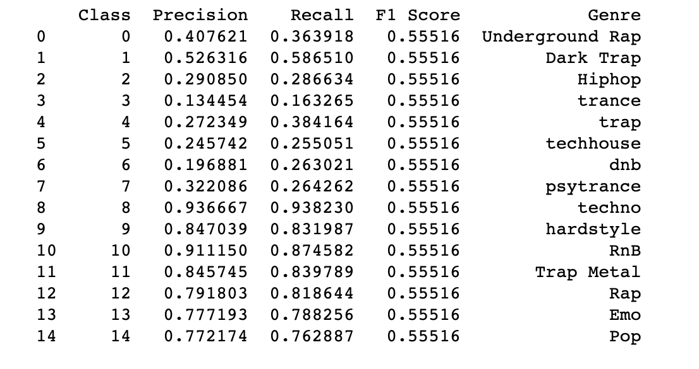

**Precision:** a higher precision value indicates that the model has ***fewer false positives for that specific class.***
For instance, in the case of "trance" (Class 3), the precision is approximately 0.134454. This means that out of all instances the model predicted as "trance," only around 13.45% of them are correct, while the remaining are false positives.

**Recall:** a higher recall value indicates that the model has ***fewer false negatives for that particular class.***
For instance, the recall for "Dark Trap" (Class 1) is approximately 0.586510. This means that the model correctly identified around 58.65% of all instances of "Dark Trap," while some instances were missed and resulted in false negatives.

**The F1 score:** provides a balanced measure of the model's performance, considering both false positives and false negatives. It is especially useful when dealing with imbalanced datasets where the number of samples in different classes varies significantly.
With an F1 score of approximately 0.55516, the model achieves a balance between precision and recall when considering all genres together. This indicates that the model's ability to correctly identify both positive and negative instances (precision and recall) for each genre is ***moderate but not exceptional.***

**ROC-AUC Analysis:** 

Below is a snapshot of a large ROC curve plot indicating the AUC of each genre, and a dataframe of all genres with their corresponding AUC values within the model:

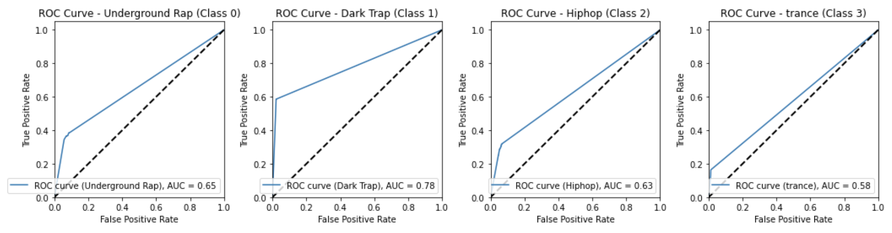

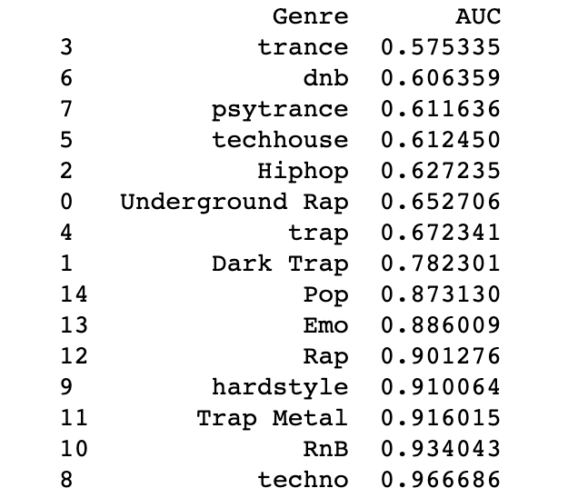

**Lowest AUC Value (0.575):** The genre 'trance' exhibits the lowest AUC value, suggesting a moderate ability of the model to distinguish 'trance' songs from other genres.

**Mid-Level AUC Values (0.627 - 0.901):** Genres like 'Hiphop' (AUC: 0.627), 'Underground Rap' (AUC: 0.653), 'trap' (AUC: 0.672), 'Dark Trap' (AUC: 0.782), 'Pop' (AUC: 0.873), 'Emo' (AUC: 0.886), and 'Rap' (AUC: 0.901) showcase moderate to strong performance in classification, indicating the model's ability to effectively differentiate these genres from others.

**Highest AUC Value (0.967):** The genre 'techno' stands out with the highest AUC value, indicating exceptional performance in classifying 'techno' songs from other genres.

### Second Model: Tuned Decision Tree

By tuning hyperparameters, we are fine-tuning the decision tree model, making it more effective in capturing the underlying patterns and relationships in the data, thereby improving its predictive capabilities on unseen data.

#### Grid Search

Grid search is useful because it automates the process of finding the best hyperparameters, saving us from manually trying out different combinations. In a grid search, we create a "grid" of all possible combinations of hyperparameter values we want to explore. The algorithm then trains and evaluates the model with each combination of hyperparameters using a specified evaluation metric based on cross-validation.

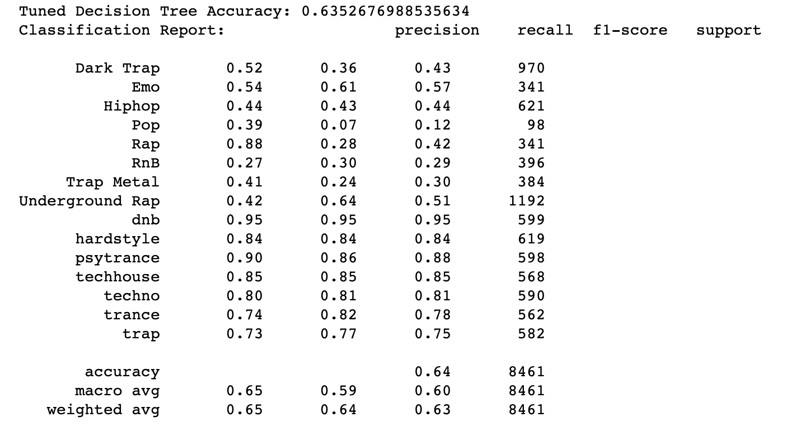

Above, we see that the model's accuracy has jumped from 0.57 (initial model) to 0.64. Nice! Let's get into the metric details:

**Robust Performance:** dnb, hardstyle, psytrance, techhouse, techno, trance
- High Precision and Recall: These genres demonstrate high precision and recall scores, indicating the model's ability to effectively predict instances of these genres.
- Distinctive Features: The unique musical characteristics and well-defined features of these electronic genres make them easier for the model to distinguish.
- Sufficient Data: There seems to be enough data available for these genres, enabling the model to learn their patterns accurately.

**Moderate Performance:** Emo, Hiphop, RnB, Underground Rap
- Balanced Precision and Recall: These genres show balanced precision and recall scores, suggesting that the model can predict instances of these genres reasonably well.
- Variability in Features: These genres can have a range of musical traits, leading to moderate performance due to the complexity of their features.

**Poor Performance:** Dark Trap, Pop, Rap, Trap Metal
- Low Recall and Precision: These genres have lower precision and recall scores, indicating the model's struggle to accurately predict instances of these genres.
- Feature Ambiguity or Similarity: The features that distinguish these genres might be ambiguous or similar to other genres, making it challenging for the model.

***As we can see, the model's performance varies significantly across different genres.*** While it excels in some genres like "dnb," "hardstyle," and "psytrance," it struggles to accurately classify genres like "Pop," "Rap," and "Trap Metal." The macro and weighted average F1-scores provide insights into the overall model performance, with an accuracy of 64% suggesting ***moderate success in classifying music genres.***

Below is a visual representation of a one level of depth of our tuned decision tree model:

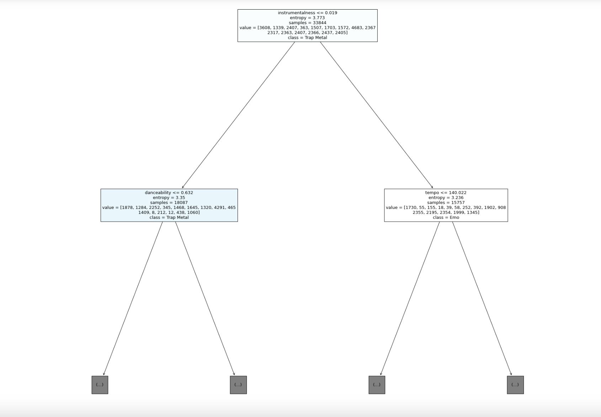

***Interesting to note:*** the initial node in our Tuned Decision Tree visualization indicates that the first split is based on the feature "instrumentalness" with a threshold of 0.019. This means that the model is using the "instrumentalness" feature to decide how to separate instances into different classes. Instances with a value of "instrumentalness" less than or equal to 0.019 will follow one branch of the tree, while those with a value greater than 0.019 will follow another branch.

### Third Model: Random Forest

A ***Random Forest Classifier*** is a versatile ensemble learning algorithm that combines the predictive power of multiple decision trees to make accurate predictions. Each decision tree in the ensemble is constructed using a random subset of the training data and features, aiming to reduce overfitting and increase generalization. When making predictions, the final output is a result of aggregating the predictions from individual trees through majority voting.

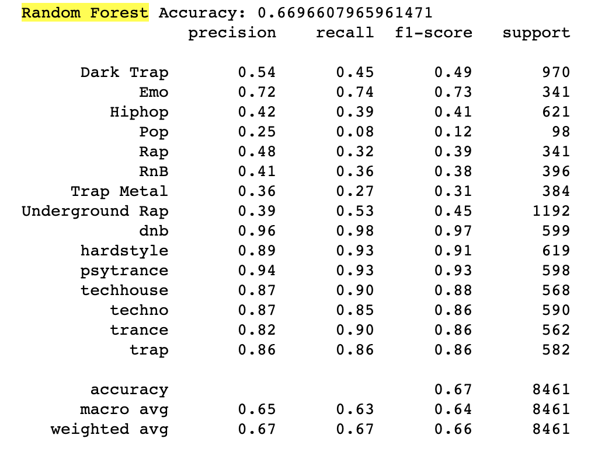

Above, we see an improvement from ~0.63 in accuracy (tuned Decision Tree) to ~0.67 (Random Forest).

Let's take a look at the above findings in the context of a confusion matrix:

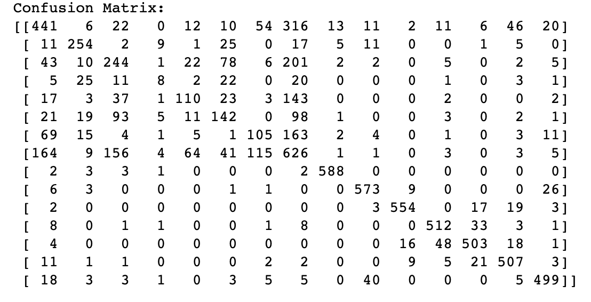

**Rows and Columns:**

Rows represent the true classes (actual genres). Columns represent the predicted classes.

**Diagonal Values (True Positives - TP):**
- These values are along the diagonal, from the top-left to the bottom-right. Each diagonal cell indicates the number of instances correctly predicted for that specific genre.
- Genres with higher diagonal values, such as "dnb," "hardstyle," "psytrance," "techhouse," "techno," "trance," and "trap," suggest that the model is correctly predicting those genres relatively well.

**Off-Diagonal Values (False Positives and False Negatives):**
- These values are outside the diagonal. They represent instances that were misclassified.
- Some genres, like "Dark Trap," "Hiphop," "Rap," and "Trap Metal," have significant off-diagonal values, indicating misclassifications.
- High off-diagonal values can be a sign of confusion between similar genres or challenges in distinguishing certain classes.

Since we took the time to visualize our first Decision Tree, it could be interestting to set random tree indices and let the code pick random trees from our random forest to visualize:

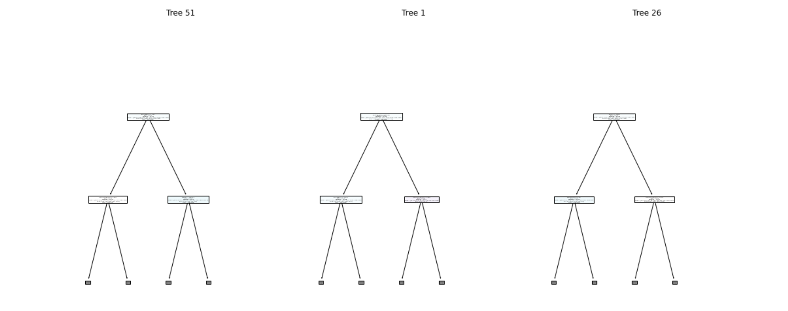

**Feature Importances:**

It's time to consider feature importance, which is a measure of the contribution of individual features toward making accurate predictions. It helps us understand which features have the most influence on the model's decision-making process.

Higher importance scores suggest that changing the values of those features has a greater impact on the model's outcomes. Features with low importance scores may be less influential in making accurate predictions.

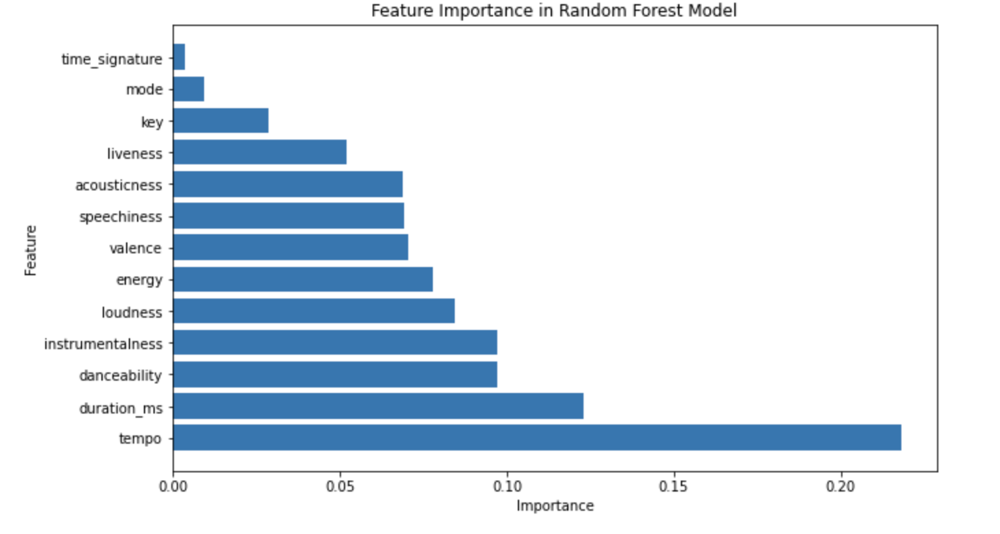

### Fourth Model: kNN Baseline 

We'll pivot to a completely different modeling technique to gain some clarity and keep our process diversified.

The K-Nearest Neighbors (k-NN) algorithm is a simple yet powerful supervised learning method used for classification tasks. It operates on the principle that similar data points tend to belong to the same class. For a given data point, k-NN identifies the (k) nearest neighbors in the training dataset and predicts the class label by majority vote among these neighbors.

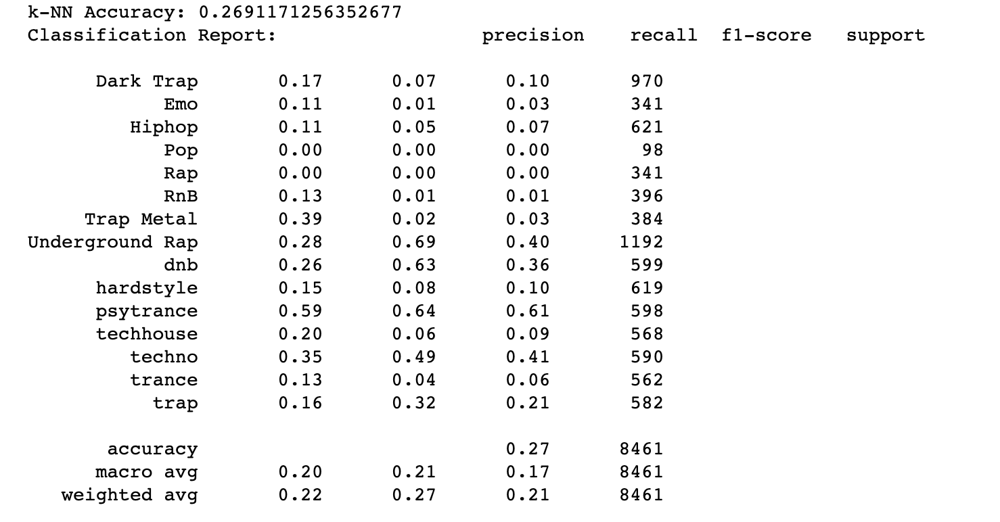

Based on the classification report and accuracy score, the k-Nearest Neighbors (k-NN) model is not performing well on our dataset. The overall accuracy is quite low at around 0.27, which means the model is not making accurate predictions on the majority of the data points.

### Final Model: Tuned kNN 

One possible reason for poor performance in the k-NN model could be ***lack of feature scaling.*** the k-NN algorithm is sensitive to the scale of features, and if features are not properly scaled, it can lead to biased results. Let's tune our k-NN model to see if performance improves.

#### Standardization of Features

To improve performance, we will try standardization (z-score normalization) to ensure features are scaled to a similar numerical range.

#### Optimal n_neighbors

Now, we can further tune our k-NN model by finding the optimal n_neighbors value. Earlier, we simply took the sqrt of our total number of data points and set it as 'k'. To further tune our model, we can use a function to find a good value of k. Using accuracy as the evaluation metric, the goal is to determine the number of neighbors that provides the best accuracy on the test set.

**Results:**

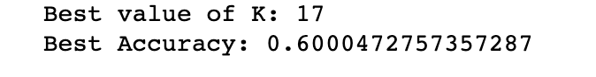

We see that the optimal n_neighbors is 17, at which point the model would supposedly be performing at peak accuracy (around 0.60), assuming it doesn't rise or fall significantly with each increase of 'k'. Let's plot an elbow curve to see if this is accurate to our dataset:

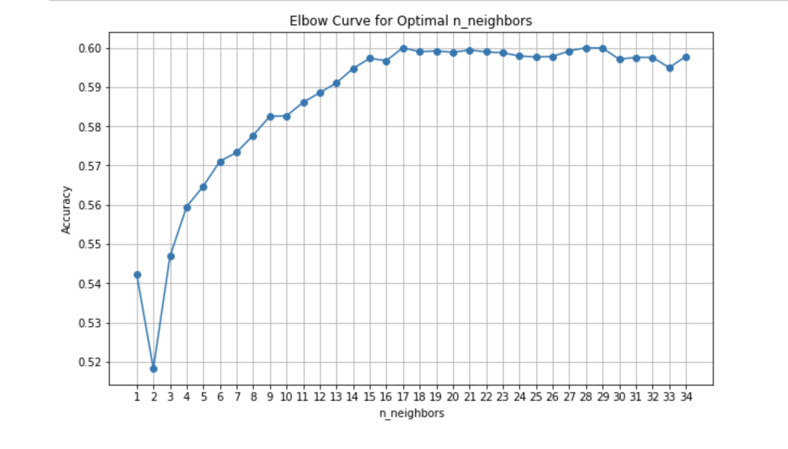

The above plot is an elbow curve depicting the relationship between the model's accuracy at different n_neighbor(s).

We notice accuracy steadily rising with each increasing neighbor until plateauing at around 0.60. This plateauing suggests that the model has reached a point where adding more neighbors doesn't significantly improve accuracy. The optimal value of n_neighbors is likely around this plateau (~17), where the model performs well without overfitting.

So, it looks like our original function to find best_k matches our method of visualizing the model's plateau point.

## Conclusion

To kickstart BeatWave's genre classification methods, we've embarked upon many different modeling iterations: a decision tree, a tuned decision tree, a random forest, a k-NN AND a tuned k-NN. That's a lot of models, and with tuning and tweaking, they all performed moderately well.

Our most accurate and robust model seems to be our Random Forest model, with an accuracy of ~ 0.67. With some more pruning and hyperperameter tuning, we think this model has the potential to perform the best out of all modeling approaches explored in this

### Limitations of the Data

It's worth noting that our dataset is inherently limited in its scope. It is heavily imbalanced and, for a streaming platform like BeatWave, we're likely to want to delve deeper into a larger dataset. The fact remains that our dataset is only at around 42,000 data points, which is pretty low considering how much electronic music exists in the world. We're also limited by the number of features (11-12 notable features). To get more accurate and robust classification models...

### Recommendations

Our most accurate and robust model seems to be the **Random Forest** model, with an accuracy of ~ 0.67. With some more pruning and hyperperameter tuning, we think this model has the potential to perform the best out of all modeling approaches explored in this process. By refining the model to reduce both false positives and false negatives, BeatWave can provide users with a more accurate and enjoyable music discovery experience, ultimately enhancing user retention and platform growth. Here are some ways paying intentional attention to false positives and negatives can impact BeatWave:

- *User Experience:* False positives could lead to users encountering music that does not match their preferences, causing frustration and potentially leading to decreased user engagement. False negatives might prevent users from discovering songs they would appreciate, leading to missed opportunities for engagement.

- *Retention and Recommendations:* Both false positives and false negatives can impact the quality of song recommendations. If users receive incorrect recommendations (false positives) or miss out on relevant ones (false negatives), they may be less likely to continue using the platform.

- *Content Curation:* BeatWave's reputation and user trust depend on accurate genre categorization. High false positive rates could undermine the platform's credibility in suggesting appropriate music.

- *Competitive Edge:* In the competitive landscape of music streaming, accurate genre prediction and personalized recommendations are crucial for user satisfaction and platform success. Addressing false positives and false negatives could help BeatWave differentiate itself positively.

To enhance the model's performance, it's advisable to concentrate on the key features that notably affect precision, recall, and F1-score. Notably, features such as "tempo," "duration_ms," and "danceability" are among the significant factors influencing the model's predictions. Directing attention to these particular features during the song classification process could potentially contribute to an improved accuracy. This could look a number of ways:
  - **Feature Scaling:** One might employ standardization to scale features of note to ensure consistent impact on Random Forest performance.
  - **Hyperparameter Tuning:** During the model training phase, experiment with different hyperparameters and configurations. Some hyperparameters, such as the number of trees in the forest, can impact the model's sensitivity to certain features.
  - **Feedback Loop:** Continuously collect user feedback and observed predictions to refine the model over time. If the model's predictions for specific genres remain inconsistent, consider re-evaluating the data quality and model settings related to the influential features.

### Next Steps

- Find or compile a much larger dataset, ensuring that majority of datapoints contain data for all features to avoid class imbalances.

- Invest in feature engineering:
    - Aggregating Features: You can calculate aggregate statistics (e.g., mean, median, variance) over different segments of a song to capture more nuanced characteristics. For example, you could calculate energy changes over different parts of the song.
    - Feature Interaction: Create new features by combining existing ones. For instance, you could multiply 'energy' and 'loudness' to capture the energetic loudness of a song.
    - Temporal Patterns: Explore the temporal patterns of features. For example, you could create features that represent the rate of change of features over time intervals.
    - Harmonic and Melodic Features: Extract features related to the harmonic and melodic aspects of music, such as chord progressions, melody patterns, and tonal intervals.
    - Domain-Specific Features: Create features specific to the domain of music, such as genre-specific features or music theory-based features.
    - Data Transformation: Apply mathematical transformations to the features, such as logarithmic scaling, to amplify certain aspects of the data. 
    
## Repository structure

├── Data

├── Images

├── .gitignore

└── README.md

├── notebook.ipynb

├── presentation.pdf
